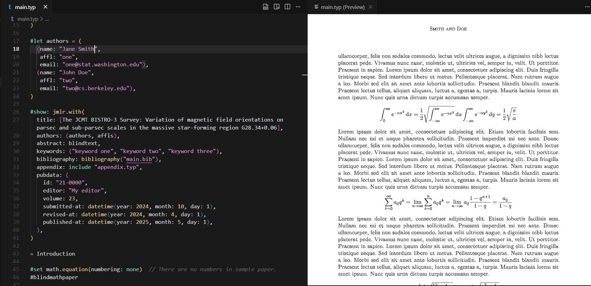

# Typst + Pandoc Dev Container

**Reproducible, containerized Typst and Pandoc toolchain** — No installation hassles. Write markup, compile PDFs, convert documents with a single `git clone` and "Reopen in Container."



## The Problem

Setting up Typst and Pandoc locally is tedious:
- **Version conflicts** across projects and systems
- **Binary installation** complexity and brittleness
- **Dependency management** across platforms (macOS, Linux, Windows)
- **Wasted time** on toolchain setup instead of document writing

This container solves it by providing a **ready-to-use, reproducible environment** where the exact versions of Typst, Pandoc, and Rust are locked and consistent.

## Quick Start (30 Seconds)

1. Clone this repository and open it in VS Code
2. Click **"Reopen in Container"** (or press <kbd>F1</kbd> → "Dev Containers: Reopen in Container")
3. In the container terminal, create `hello.typ`:
   ```typst
   #set text(size: 14pt)
   = Hello, Typst!
   This is a simple PDF document.
   ```
4. Compile to PDF:
   ```bash
   typst compile hello.typ
   ```
5. View `hello.pdf` — done!

## Key Features

- **[Typst](https://typst.app/)** — Modern, fast markup-based typesetting system (similar to LaTeX but simpler syntax)
- **[Pandoc](https://pandoc.org/)** — Universal document converter (LaTeX ↔ Typst, Markdown → PDF, and more)
- **Rust toolchain** — Pre-installed for Typst development and customization
- **VS Code integration** — Dev Container support with recommended extensions
- **Multi-platform** — Runs on macOS, Linux, Windows (via Docker Desktop, WSL 2, or Codespaces)

## Included Versions

This container bundles:
- **Typst**: 0.15.1, 0.15.0, 0.14.2 (latest stable)
- **Pandoc**: 3.10.2
- **Rust**: 1.97.1
- **Base image**: Debian 11 (Bullseye)

See [STATUS.md](./STATUS.md) for version details and release notes.

## Why This Is Better Than Manual Setup

| Aspect | Manual Install | This Container |
|--------|---|---|
| **Setup time** | 10–30 minutes | 1–2 minutes (first run pulls image) |
| **Version consistency** | Varies by machine | Locked and reproducible |
| **Platform support** | OS-specific scripts needed | Works on macOS, Linux, Windows |
| **Collaboration** | "Works on my machine" syndrome | Same environment for all developers |
| **Cleanup** | Files scattered system-wide | Single `docker stop` command |

## Usage

### Typst → PDF

Create a new Typst document (`.typ` file):

```typst
#set text(font: "Linux Libertine", size: 11pt)
#set page(
  paper: "us-letter",
  margin: (x: 1.5in, y: 1in),
)

= A Typst Document

This is a simple example. Typst uses modern,
intuitive syntax compared to LaTeX.

- Fast compilation
- Beautiful defaults
- Powerful scripting
```

Compile and preview:

```bash
# One-time compile
typst compile document.typ document.pdf

# Watch for changes and auto-compile
typst watch document.typ document.pdf
```

### LaTeX → Typst Conversion

Convert existing LaTeX or Word documents:

```bash
# LaTeX to Typst
pandoc article.tex -o article.typ

# Word to Markdown (then edit for Typst)
pandoc document.docx -o document.md

# Markdown to PDF via Typst
pandoc README.md -o README.pdf --from markdown
```

## Prerequisites

1. **VS Code** or compatible IDE (VS Codium, Cursor, etc.)
2. **[Dev Containers extension](https://marketplace.visualstudio.com/items?itemName=ms-vscode-remote.remote-containers)**
3. **Docker** (Docker Desktop on macOS/Windows, Docker Engine on Linux)

**Optional**: Use GitHub Codespaces — no local Docker needed.

## Troubleshooting

### Container fails to build
- **Ensure Docker is running** and has sufficient disk space (minimum 2GB)
- **Pull latest image**: `docker pull mcr.microsoft.com/devcontainers/javascript-node:1-18-bullseye`
- **Check logs**: Open the "Remote" output panel in VS Code for detailed error messages

### `typst` or `pandoc` command not found
- **Verify container is running**: Check the bottom-left corner of VS Code shows "Dev Container"
- **Re-open container**: Close and reopen the workspace in the container

### Slow first startup
- **First build pulls ~500MB image** — subsequent starts are instant
- **Network speed matters** — faster internet = faster initial setup

## Learn More

- [Typst Documentation](https://typst.app/docs/)
- [Pandoc User Guide](https://pandoc.org/MANUAL.html)
- [Dev Containers Specification](https://containers.dev/)

## License

MIT License — see [LICENSE](./LICENSE) for details.

## Contributing

Found a bug or have an improvement? [Open an issue](https://github.com/1solomonwakhungu/typst-dev-container/issues) or submit a pull request.

See [CONTRIBUTING.md](./CONTRIBUTING.md) for guidelines.
